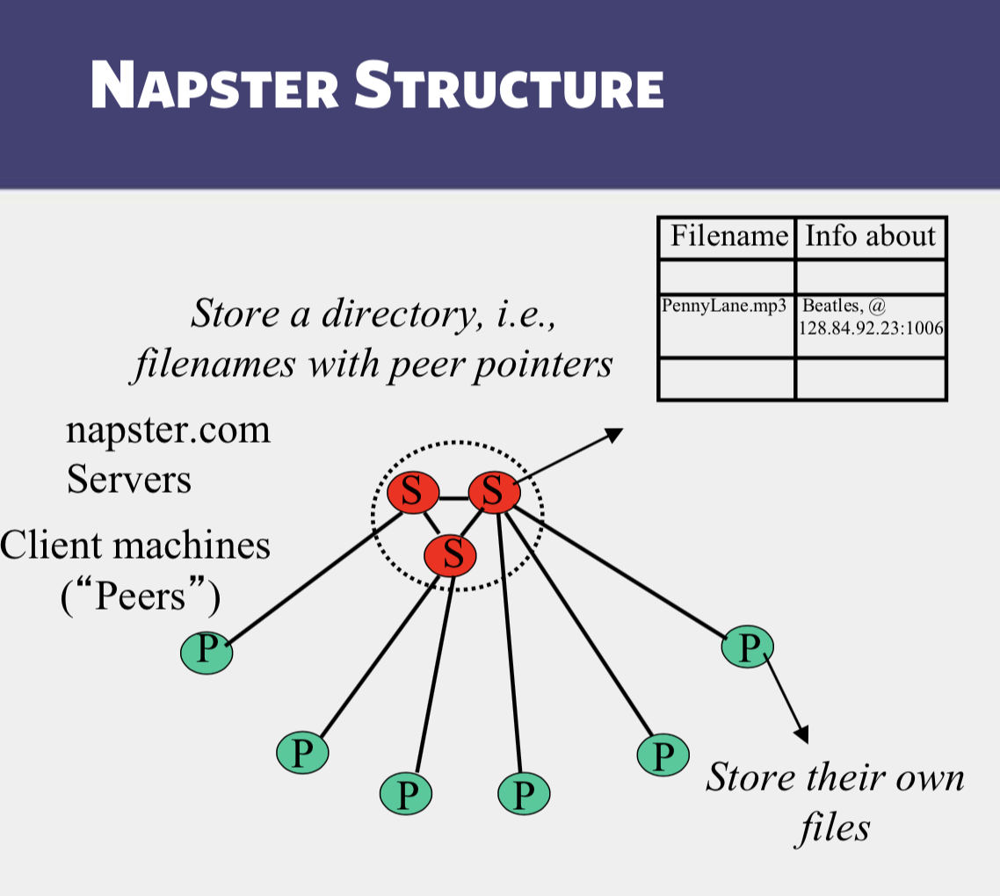

## Napster Structure

## Client
- Connect to a Napster server
    - **Upload** list of music files
    - Server maintains list of **<filename,ip_address, portnum>**. Server stores no files.
    - **Search**
        - Send server keywords
        - Server searches its list with keywords
        - Server returns a list of hosts **<ip_address, portnum>** tuples to client
    - Client **pings** each host in the list to find transfer rates
    - Client fetches file from best host
- All communication uses TCP
    - Reliable and orderd networking protocol

## Napster Search

**Tenary Tree algorithm**

## Problems
- Centralized server a source of **congestion**
- Centralized server single point of failure
- **No security**: plaintext messages and passwds
- napster.com declared to be responsible for users' copyright violation
    - "Indirect infringement"
    - Next system: Gnutella